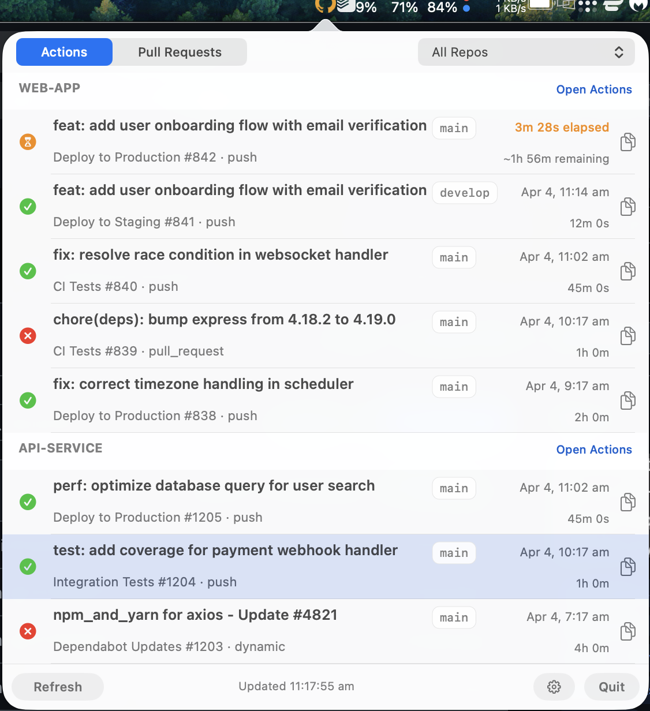
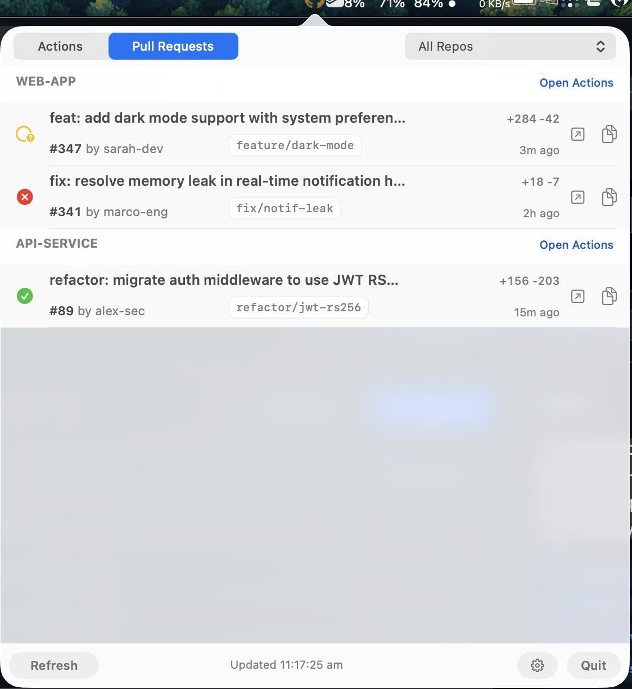

# Cat Eye — GitHub Actions & PR Monitor for macOS

> A lightweight, native macOS menu bar app for monitoring GitHub Actions CI/CD status and pull request reviews. Open source, 225KB, zero Electron.

The octocat's eye never blinks.

**There are plenty of GitHub status apps out there.** Most are Electron wrappers that eat 200MB+ of RAM to show you a green checkmark. Cat Eye exists because a status indicator shouldn't cost more than the IDE it sits next to.

This is a **native macOS menu bar app** — a single 225KB Swift binary, ~31MB RSS, zero frameworks beyond AppKit. It does one thing: shows you whether your GitHub Actions are passing and your PRs need attention. No dashboard, no analytics, no features you'll never use. Just a colored icon that turns red when something breaks.

| Actions tab | Pull Requests tab |
|:-----------:|:-----------------:|
|  |  |

## Features

### Actions Tab
- **Live status icon** — GitHub mark tinted by status, with a small badge glyph (check / cross / hourglass) so state is readable without colour
- **Pulsing animation** — icon gently pulses when any action is actively running
- **Rich popover** — scrollable list of recent runs across all your repos, styled like the GitHub Actions UI
- **Per-run details** — workflow name, run number, branch badge, timestamps, and duration
- **Expandable run rows** — click a run to expand it inline: failed runs show the exact failure annotations (job/step + message), successful runs show the full commit message and durations, in-progress runs show live elapsed time and per-workflow status
- **Calculated ETA** — estimates remaining time for running actions based on historical durations
- **macOS notifications** — alerts when actions start, pass, or fail — click the notification to open the popover

### Pull Requests Tab
- **Review queue** — shows PRs where your review is requested, across all tracked repos
- **Expandable detail** — click any PR to expand inline with full description and labels
- **PR actions** — approve, request changes, comment, merge (merge/rebase/squash), or close — all from the menu bar
- **Inline comments** — type and submit comments without leaving the popover
- **Safe input** — popover won't dismiss while you're typing a comment

### General
- **Tabbed interface** — switch between Actions and Pull Requests
- **Repo filter** — "All Repos" or pick a specific repo; persists across tabs
- **Built-in setup** — login to GitHub and pick repos to track from the settings panel
- **Keyboard accessible** — navigate rows with Tab, activate with Return or Space
- **Colour-blind friendly** — status colours use the Okabe-Ito colour-blind-safe palette, and every state also carries a shape or text signal (badge glyphs, spelled-out statuses, tooltips)
- **Copy URL** — one-click copy of any run or PR URL to clipboard
- **Direct links** — click to open runs or PRs in GitHub
- **Multi-repo** — monitor as many repos as you want from a single widget
- **Adaptive polling** — 30s when idle, 10s when actions are running (configurable)
- **Hot-reload config** — change tracked repos from settings without restarting
- **Auto-detects `gh` CLI** — finds your GitHub CLI install automatically
- **Error feedback** — clear messages when gh CLI is missing, auth fails, or API errors occur
- **Tiny footprint** — 225KB binary, ~31MB memory, zero dependencies beyond macOS

## Requirements

- macOS 13+ (Ventura or later)
- [GitHub CLI](https://cli.github.com/) (`gh`) installed and authenticated (`brew install gh && gh auth login`)
- Apple Silicon or Intel Mac
- Xcode Command Line Tools only if building from source (`xcode-select --install`)

## Installation

### Option 1: Homebrew (recommended)

```bash
brew tap clintoncodewell/tap
brew install cat-eye
```

Then launch with `open $(brew --prefix)/CatEye.app`.

### Option 2: Download binary

Grab `CatEye.zip` from the [latest release](https://github.com/clintoncodewell/cat-eye/releases), unzip, and double-click. On first launch, macOS will block it — right-click → Open → Open to bypass Gatekeeper (required for unsigned apps).

### Option 3: Build from source

```bash
# Prerequisites (skip if already installed)
xcode-select --install   # Xcode Command Line Tools
brew install gh           # GitHub CLI

# Clone and build
git clone https://github.com/clintoncodewell/cat-eye.git
cd cat-eye
./build.sh

# Run
open CatEye.app
```

On first launch, the **Settings panel** opens automatically:

1. **Login** — click "Login..." to authenticate with GitHub (opens Terminal with `gh auth login --web`)
2. **Pick repos** — your repos and org repos are fetched automatically; check the ones you want to track
3. **Add manually** — type `owner/repo` in the "Add Repo Manually" field for repos not in the list
4. **Save** — click "Save & Apply" and you're monitoring

Reopen Settings any time via the gear icon in the footer. You can also **Logout** from the Settings panel.

### Make it findable via Spotlight / Raycast

```bash
# Symlink into ~/Applications (indexed by Spotlight)
ln -sf "$(pwd)/CatEye.app" ~/Applications/CatEye.app
```

Then search for **"Cat Eye"** in Spotlight or Raycast.

### Auto-start on login

```bash
cat > ~/Library/LaunchAgents/com.cateye.plist << 'EOF'
<?xml version="1.0" encoding="UTF-8"?>
<!DOCTYPE plist PUBLIC "-//Apple//DTD PLIST 1.0//EN" "http://www.apple.com/DTDs/PropertyList-1.0.dtd">
<plist version="1.0">
<dict>
    <key>Label</key>
    <string>com.cateye</string>
    <key>ProgramArguments</key>
    <array>
        <string>/usr/bin/open</string>
        <string>/path/to/cat-eye/CatEye.app</string>
    </array>
    <key>RunAtLoad</key>
    <true/>
</dict>
</plist>
EOF

# Enable it
launchctl load ~/Library/LaunchAgents/com.cateye.plist
```

Replace `/path/to/cat-eye/` with your actual install path.

## Configuration

Config lives in `~/.config/cat-eye/config.json` (managed via the Settings panel, or edit directly):

```json
{
    "repos": [
        "myorg/backend",
        "myorg/frontend",
        "myuser/side-project"
    ],
    "pollInterval": 30,
    "pollActiveInterval": 10,
    "runsPerRepo": 10,
    "filterDefaultBranches": false
}
```

| Key | Default | Description |
|-----|---------|-------------|
| `repos` | `[]` | GitHub repos to monitor (`owner/repo` format) |
| `pollInterval` | `30` | Seconds between checks when idle |
| `pollActiveInterval` | `10` | Seconds between checks when a run is in progress |
| `runsPerRepo` | `10` | Number of recent runs to fetch per repo |
| `filterDefaultBranches` | `false` | Hide workflow runs from branches other than `main` or `develop` |

## Using the Pull Requests tab

Switch to the **Pull Requests** tab to see PRs where your review is requested.

- **Expand a PR** — click any PR row to expand it inline, showing the description, labels, and action buttons
- **Approve** — click "Approve" (optionally type a comment first)
- **Request changes** — type your feedback in the comment field, then click "Changes" (comment is required)
- **Comment** — type in the comment field and click "Comment"
- **Merge** — pick a merge strategy (Merge commit / Rebase / Squash) from the dropdown, then click "Merge"
- **Close** — click "Close", then confirm by clicking "Sure?" (auto-resets after 3 seconds)
- **Filter** — use the repo dropdown in the top bar to focus on a specific repo

When a PR is expanded, the popover switches to **semitransient** mode so it won't close while you're typing a comment.

## Building from source

```bash
# Requires Xcode Command Line Tools
xcode-select --install

# Build (produces CatEye.app)
./build.sh
```

## How it works

- Uses the `gh` CLI under the hood — no API tokens to manage, no OAuth flows. If `gh auth status` works, Cat Eye works.
- Fetches run and PR data via `gh run list` and `gh pr list` for each configured repo, all concurrently.
- PR tab uses `review-requested:@me` to show only PRs where your review was explicitly requested.
- PR actions (approve, comment, merge, close) call `gh pr review`, `gh pr comment`, `gh pr merge`, and `gh pr close` respectively.
- Runs as a macOS accessory app (no Dock icon, no Cmd+Tab entry).
- Notifications use the native `UserNotifications` framework — respects Do Not Disturb and Focus modes.

## Menu bar icon states

Colours come from the [Okabe-Ito colour-blind-safe palette](https://jfly.uni-koeln.de/color/), and each state also punches a badge glyph into the icon so it's readable without colour perception.

| Icon | Badge | Meaning |
|------|-------|---------|
| Bluish green | Checkmark | All recent key runs passing |
| Vermillion | Cross | Most recent deploy/test run failed |
| Sky blue (pulsing) | Hourglass | A run is currently in progress |
| Gray | — | No data or no repos configured |

Prioritizes **deploy** and **smoke test** workflows for overall status, so Dependabot noise won't turn your icon red.

## Troubleshooting

| Problem | Fix |
|---------|-----|
| Icon stays gray, "GitHub CLI not found" | Install gh: `brew install gh` and restart Cat Eye |
| "Not authenticated" error | Run `gh auth login` in Terminal, or click Login in Settings |
| No PRs showing | The PR tab only shows PRs where **your review is requested** — not all open PRs |
| Popover closes while typing | Expand a PR first — this switches to semitransient mode |
| Config changes not taking effect | Click "Save & Apply" in Settings — no restart needed |
| Build fails | Ensure Xcode Command Line Tools are installed: `xcode-select --install` |

## Why Cat Eye?

| | Cat Eye | Typical Electron app |
|---|---|---|
| **Binary** | 225 KB | 150–300 MB |
| **Memory** | ~31 MB (0.2%) | 200–400 MB |
| **CPU at idle** | 0% | 0.5–2% |
| **Dependencies** | macOS + `gh` CLI | Node.js, Chromium, npm packages |
| **Startup** | Instant | 2–5 seconds |

Cat Eye is a single Swift file compiled to a native binary. No runtime, no garbage collector, no bundled browser engine. It wakes up every 30 seconds, runs a few `gh` CLI commands, updates a menu bar icon, and goes back to sleep.

## Process info

| | |
|---|---|
| **Process name** | `cat-eye` |
| **Spotlight name** | Cat Eye |
| **Binary size** | ~225KB |
| **Memory** | ~31 MB / 0.2% on 16GB Mac |
| **Bundle ID** | `com.clintoncodewell.cat-eye` |

## Contributing

Contributions welcome — see [CONTRIBUTING.md](CONTRIBUTING.md). The short version: keep it lean (one Swift file, zero dependencies), keep it secure, keep it accessible.

## License

[MIT](LICENSE)
